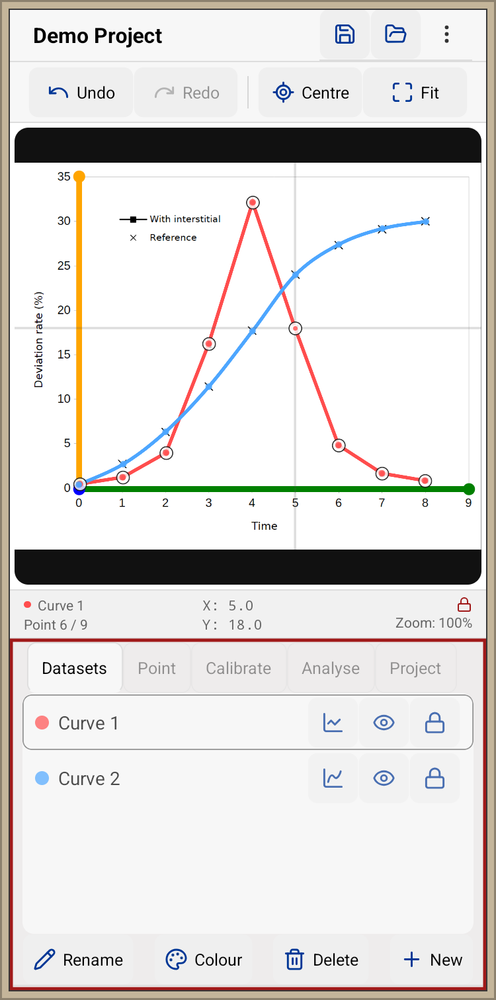
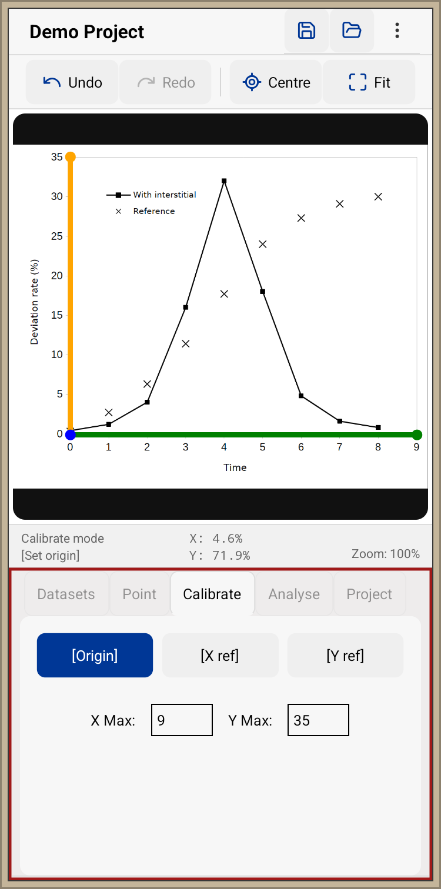
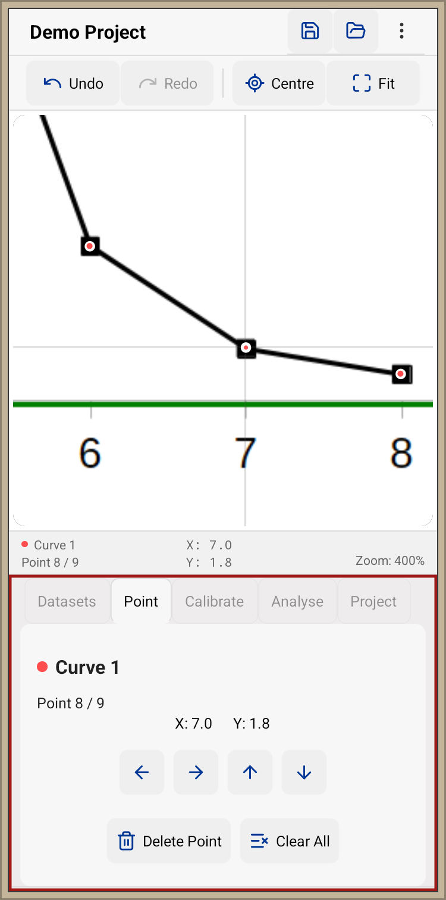

# Graph Digitizer

A React Native graph digitization tool for extracting numerical data from chart images.

## Overview

Graph Digitizer allows users to load a chart image, calibrate the graph axes, digitize data points, and export the resulting data as CSV.

The application is designed for extracting numerical data from graphs when the original data is unavailable.

## Features

* Load graph and chart images
* Calibrate graph coordinates using reference points
* Create and manage multiple datasets
* Add, move, and delete data points
* Undo and redo editing operations
* Pan and zoom the graph image
* Save and load projects
* Export datasets as CSV
* Display linear or spline-interpolated curves

## Technology

* React Native
* Expo
* React Native SVG
* React Native Reanimated
* AsyncStorage

## Screenshots

### Spline Interpolation

Visualize interpolated curves and manage multiple datasets.

  

### Calibration

Define graph axes and reference points for coordinate conversion.

  

### Data Fitting

Digitize points and perform curve fitting.

  

## Status

Version 0.1.2

## License

Not currently licensed for redistribution.
