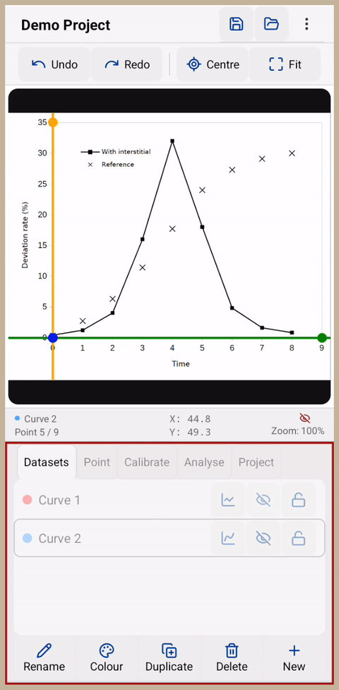
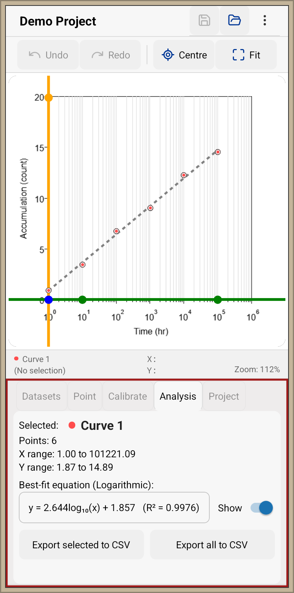

# Graph Digitizer

A React Native graph digitization tool for extracting numerical data from chart images.

## Overview

Graph Digitizer allows users to load a chart image, calibrate the graph axes, digitize data points, export the resulting data as CSV, and share complete projects publicly.

The application is designed for extracting numerical data from graphs when the original data is unavailable.

## Features

### Calibration

* One-point and two-point axis calibration
* Linear and logarithmic axes
* Draggable calibration handles
* Live calibration guides

### Digitizing

* Multiple datasets
* Real-time spline curves
* Point nudging
* Dataset translation
* Undo/redo

### Analysis

* Linear regression
* Interpolation

### Projects

* Save/load projects
* CSV export
* Share projects via public sharing service

## Technology

* React Native
* Expo
* React Native SVG
* React Native Reanimated
* AsyncStorage
* Node.js backend

## Screenshots

### Spline Interpolation

Visualize interpolated curves and manage multiple datasets.

  

### Data Fitting

Digitize points and perform curve fitting.

  

### Calibration

Define graph axes and reference points for coordinate conversion.

  

### Analysis

Best-fit curve with equation and statistics.

  

## Status

Version 0.3.1

This project is under active development. The current release supports local project storage and public project sharing.

## License

Not currently licensed for redistribution.
