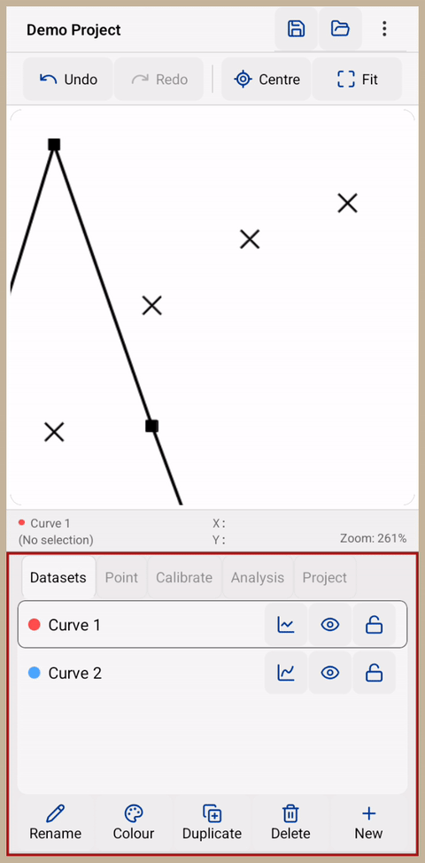
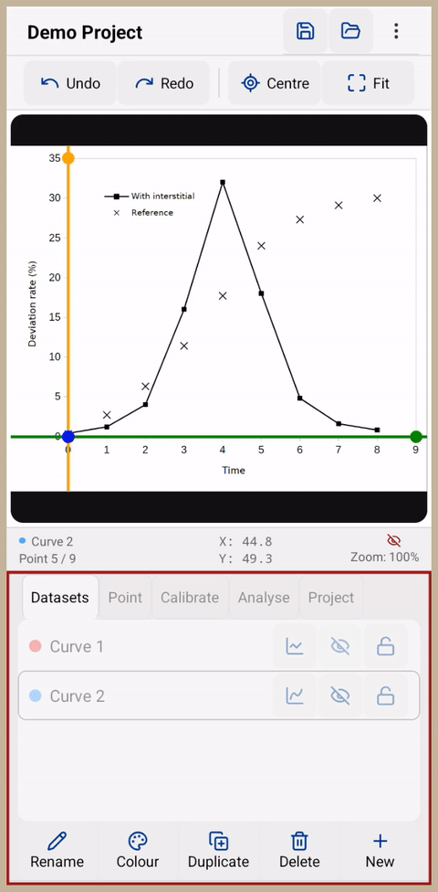
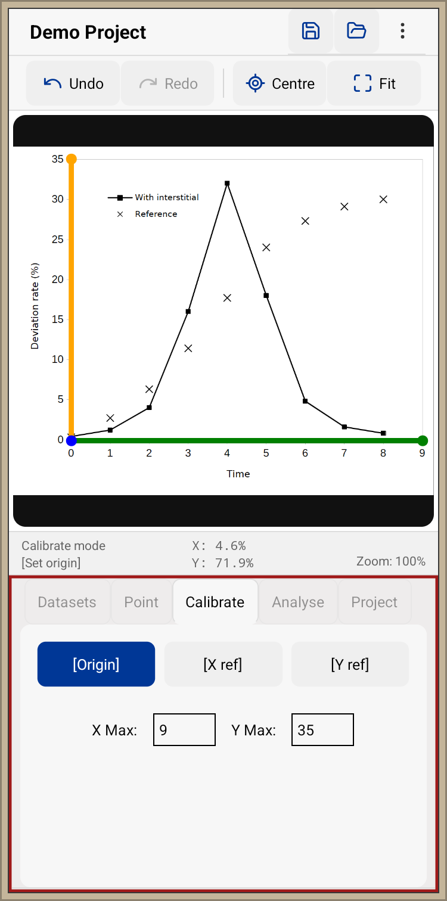

# Graph Digitizer

A high-performance React Native graph digitization tool for extracting numerical data from chart images.

## Technical Overview

Graph Digitizer allows users to load a chart image, calibrate axes (linear or logarithmic), digitize data points, and perform mathematical analysis. This project is built to demonstrate performance-minded cross-platform mobile development, complex state management, and real-time canvas mathematics.

## Live Preview

Live curve updates with auto snap-to-point.

  

## Architecture & Technical Challenges

### 60fps Fluid Gesture Performance

- **The Challenge:** Redrawing complex SVG spline curves at 60Hz during continuous touch gestures can heavily bottleneck the JavaScript thread, causing severe rendering lag.
- **The Solution:** Offloaded high-frequency touch data entirely to the UI thread using **React Native Reanimated Shared Values**. Touch interactions update the canvas fluidly in real-time, and state is only synced back to the React JavaScript thread upon gesture completion (`onEnd`), keeping the main bridge free.

### Coordinate Transformation Matrix

- Engineered pure utility calculation layers to translate raw pixel touch coordinates `(x, y)` into precise, calibrated mathematical units `(X, Y)`.
- Handled edge cases for both linear scaling and logarithmic transformations depending on axis configuration.

## Engineering Trade-offs & Known Technical Debt

- **State Complexity:** Canvas history handles deep objects (multiple datasets, undo/redo stacks). State is currently managed via custom local hooks. For enterprise scalability with massive coordinate sets, migrating this state layer to a dedicated manager like **Zustand** or **Redux Toolkit** would optimize re-render boundaries.
- **Component Layout:** `MainScreen` currently acts as a heavy orchestrator. Future refactoring will decouple the UI container from the business logic layer entirely.

## Tech Stack

- **Framework:** React Native (Expo)
- **Graphics:** React Native SVG
- **Animation & Gestures:** React Native Reanimated & Gesture Handler
- **Storage:** AsyncStorage
- **Backend Integration:** Node.js backend services

## Features Breakdown

- **Calibration:** One-point/Two-point axis calibration, linear and logarithmic options.
- **Digitizing:** Multiple datasets, real-time spline curves, auto snap-to-curve, high-accuracty point adjustment.
- **Analysis:** Linear regression, interpolation.
- **Data Portability:** Local project storage, CSV export, and public link sharing.

## Screenshots

### Spline Interpolation

Visualize interpolated curves and manage multiple datasets.

  

### Calibration

Define graph axes and reference points for coordinate conversion.

  

## Status

Version 0.4.1

This project is under active development. The current release supports local project storage and public project sharing.

## License

This project is licensed under the MIT License - see the LICENSE file for details.
